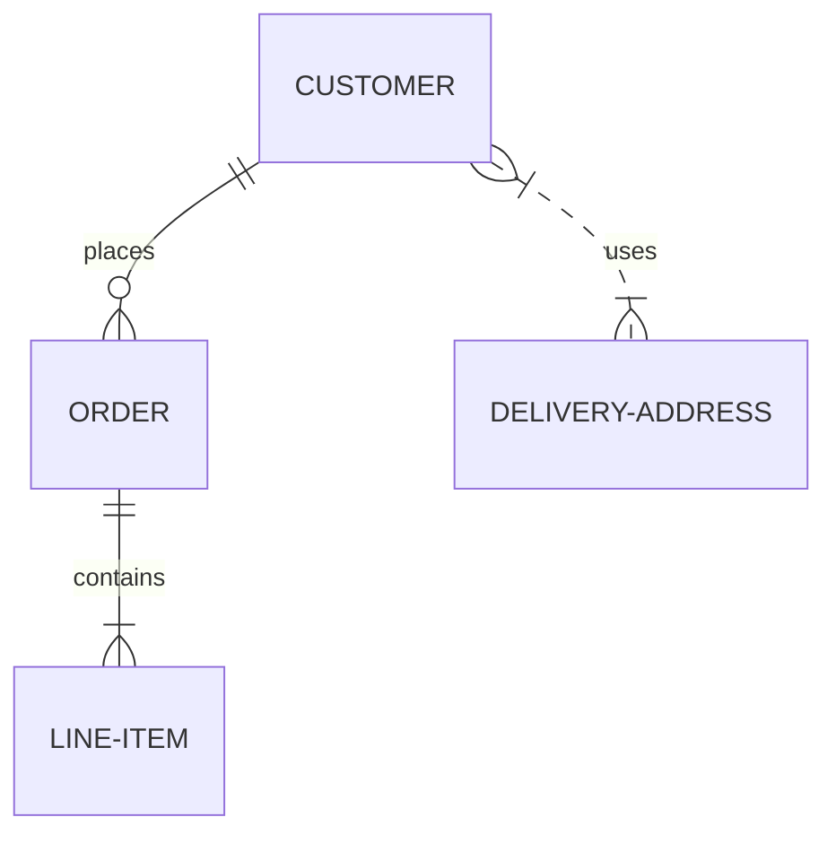
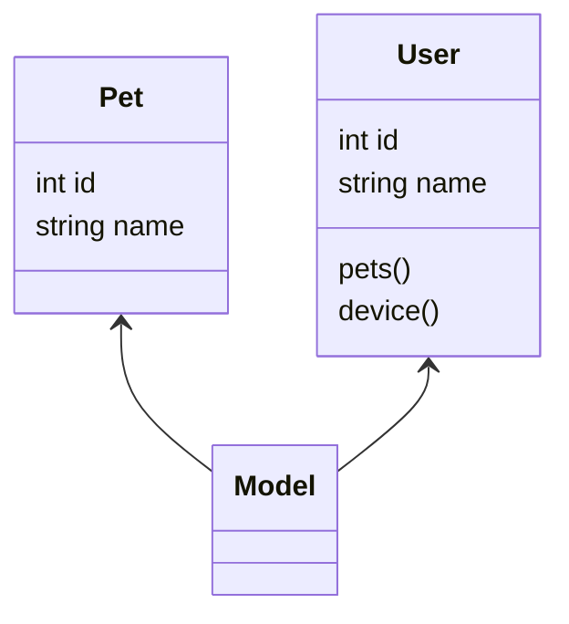

```mermaid

erDiagram
    CUSTOMER ||--o{ ORDER : places
    ORDER ||--|{ LINE-ITEM : contains
    CUSTOMER }|..|{ DELIVERY-ADDRESS : uses
```

```mermaid
classDiagram
    Pet <-- Model
    Pet : int id
    Pet : string name
    User <-- Model
    User : pets()
    User : device()
    User : int id
    User : string name
```

<!-- docfast-js-db-graphs -->

<!-- /docfast-js-db-graphs -->