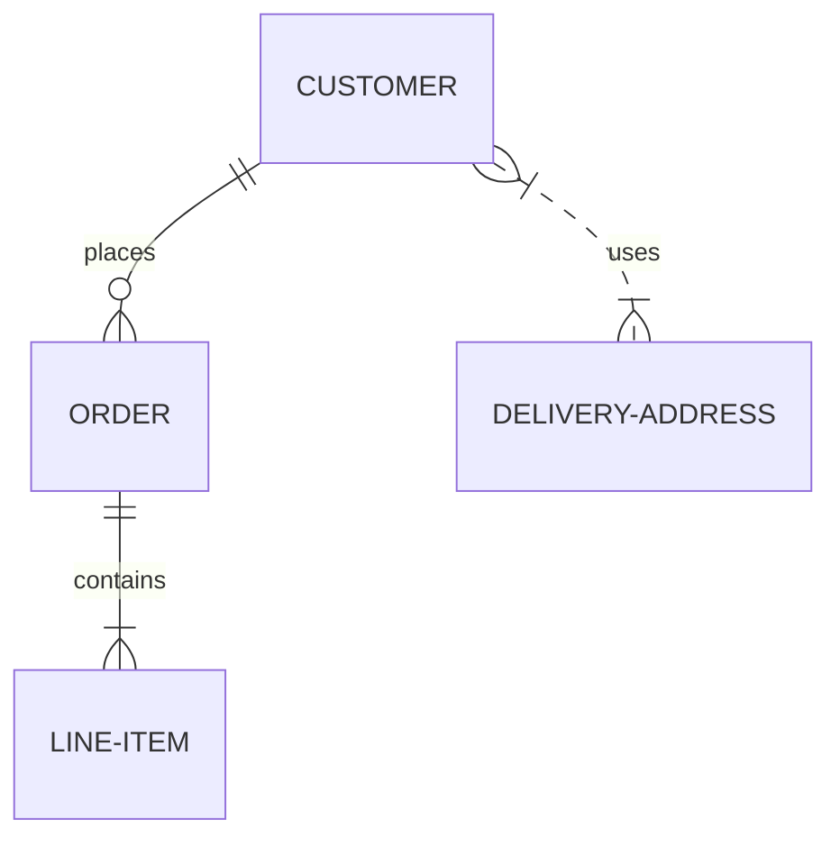
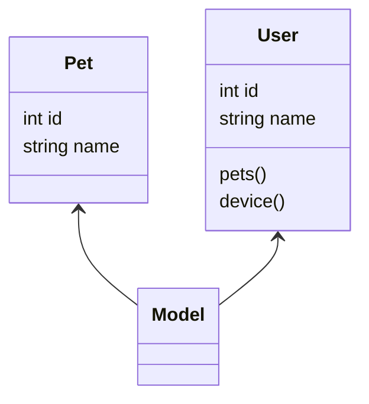

<!-- docfast-js-db-graph -->
```mermaid
classDiagram
   User <-- Model
   User : integer id: primary
   User : string name
   User : integer device_id: foreign

   Pet <-- Model
   Pet : integer id: primary
   Pet : string name
   Pet : integer age

   Device <-- Model
   Device : integer id: primary


```
<!-- /docfast-js-db-graph -->